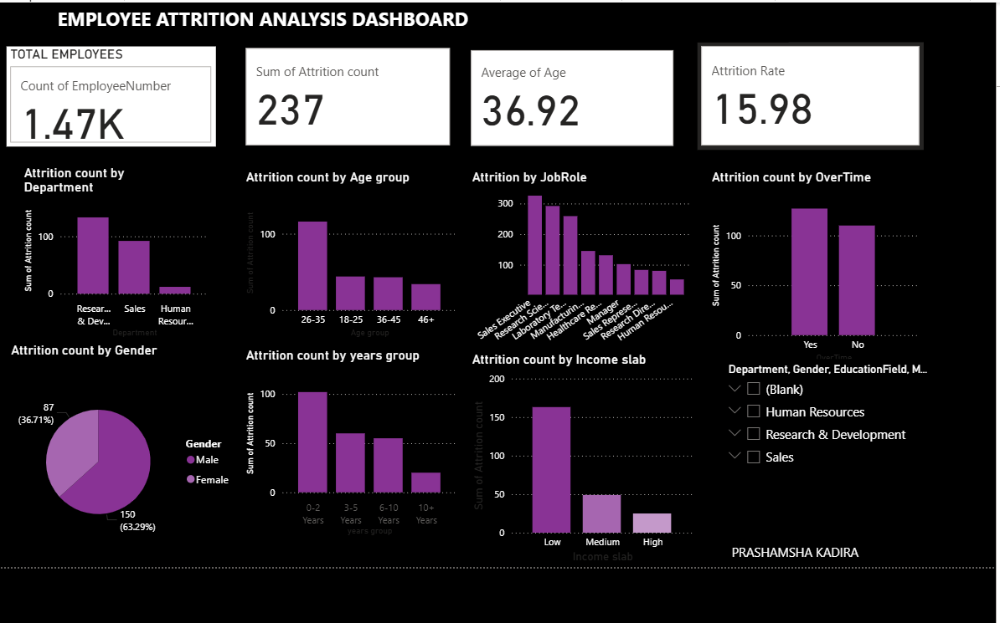

# 📊 Employee Attrition Analysis Dashboard (Power BI)

## 📌 Project Overview

This project focuses on analyzing employee attrition using HR analytics techniques. The dashboard is built using Power BI to identify patterns, trends, and key factors influencing employee turnover within an organization.

---

## 🎯 Objectives

* Analyze employee attrition trends
* Identify departments with high attrition
* Understand the impact of age, gender, income, and experience on attrition
* Provide data-driven insights for HR decision-making

---

## 📊 Dashboard Features

* KPI Cards:

  * Total Employees
  * Attrition Count
  * Attrition Rate
  * Average Age

* Attrition Analysis by:

  * Department
  * Job Role
  * Gender
  * Age Group
  * Income Slab
  * Years of Experience
  * Overtime

---

## 📈 Key Insights

* Highest attrition observed in **Research & Development department**
* Employees aged **26–35 years** show the highest attrition
* **Lower income group** employees have higher attrition rates
* Majority of attrition occurs within **0–2 years of experience**
* Employees working **overtime** show higher attrition

---

## 🛠 Tools & Technologies Used

* Power BI (Dashboard Creation & Visualization)
* Microsoft Excel (Data Cleaning & Preparation)

---

## 📂 Project Files

## 📂 Project Files
- `EMPLOYEE ATTRITION.pbix` → Power BI dashboard file
- `HR_EMPLOYEE_ATTRITION_DATA.xlsx` → Dataset used for analysis
- `dashboard.png` → Dashboard preview image

---

## 📷 Dashboard Preview

---

## 🚀 How to Use

1. Download the `.pbix` file
2. Open in Power BI Desktop
3. Explore the dashboard and apply filters/slicers

---

## 💡 Business Impact

This dashboard helps HR professionals to:

* Identify high-risk employee groups
* Improve employee retention strategies
* Support data-driven HR decisions

---

## 👩‍💻 Author

**Prashamsha**
MBA (HR) | Aspiring HR Analyst
